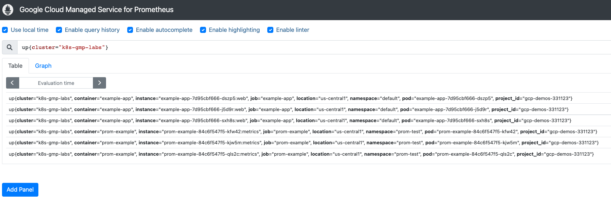
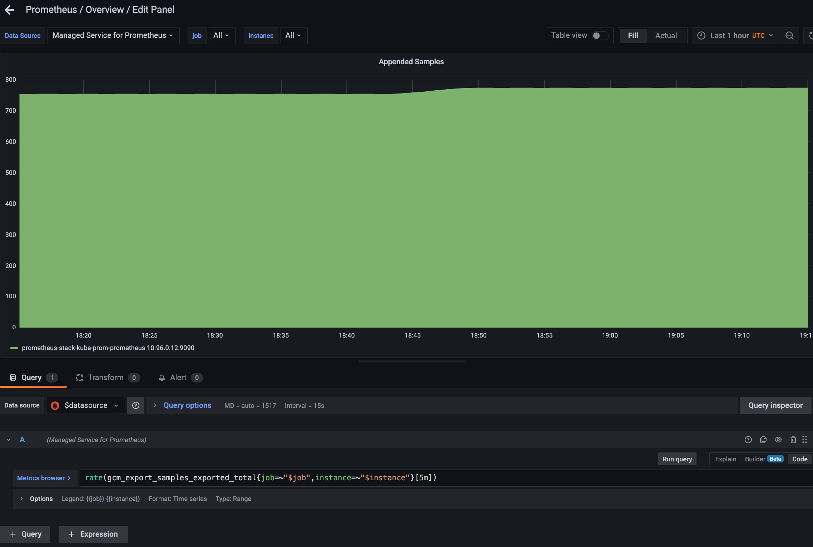

# Scraping Metrics App metrics with GMP and Managed Collections

## 1 Configure GMP and Managed Collections

### 1.1 Create Regional GKE Cluster on GCP with GMP

**Step 1** Enable the Google Kubernetes Engine API.
```
gcloud services enable container.googleapis.com
```

**Step 2** From the cloud shell, run the following command to create a cluster with 1 node:

```
gcloud beta container clusters create k8s-gmp-labs \
--region us-central1 \
--enable-ip-alias \
--enable-network-policy \
--num-nodes 1 \
--machine-type "e2-standard-4" \
--release-channel regular \
--enable-managed-prometheus
```

```
gcloud container clusters get-credentials k8s-gmp-labs --region us-central1
```

**Step 3** List the Google Managed Prometheus (GMPs) Custom Resources Definitions (CRD's)

```
kubectl get crd | grep monitoring
```

```
clusterpodmonitorings.monitoring.googleapis.com       2022-07-12T20:26:52Z
clusterrules.monitoring.googleapis.com                2022-07-12T20:26:52Z
globalrules.monitoring.googleapis.com                 2022-07-12T20:26:53Z
operatorconfigs.monitoring.googleapis.com             2022-07-12T20:26:53Z
podmonitorings.monitoring.googleapis.com              2022-07-12T20:26:53Z
rules.monitoring.googleapis.com                       2022-07-12T20:26:54Z
```


### 1.2 Verify SA account has correct permissions. 


**Option 1:** Using GKE with `default` Compute Service Account, should have all required permissions as it is using Editor role (roles/editor) on the project. (without WI enabled)

**Option 2:** Using GKE with custom Service Account for Nodes (without WI enabled)

Make sure default compute `SA` has `monitoring.metricWriter` and `monitoring.viewer` roles:

```
gcloud projects get-iam-policy $PROJECT_ID
```

If you have `Editor` role or `roles/monitoring.metricWriter` and `role: roles/monitoring.viewer` skip the step.
Otherwise add following roles tp SA.


```
gcloud projects add-iam-policy-binding $PROJECT_ID \
 --member='serviceAccount:$PROJECT_NUMBER-compute@developer.gserviceaccount.com' \
 --role=roles/monitoring.metricWriter

gcloud projects add-iam-policy-binding $PROJECT_ID \
 --member='serviceAccount:$PROJECT_NUMBER-compute@developer.gserviceaccount.com' \
 --role=roles/monitoring.viewer
```

**Option 3:** If using GKE with WI, follow the [Configure a service account for Workload Identity](https://cloud.google.com/stackdriver/docs/managed-prometheus/setup-unmanaged#gmp-wli-svcacct) instructions

**Option 4:** If using Non-GKE Kubernetes clusters, follow the [Provide credentials explicitly](https://cloud.google.com/stackdriver/docs/managed-prometheus/setup-unmanaged#explicit-credentials) instructions


### 1.3 Deploy `prom-example` application and scrape custom metrics with `PodMonitoring`

GMP out of the box doesn't scrape any metrics. In order to see any scraped Metrics in Prometheus UI or Grafana, 
we need to have deployed application and configure it as target for scraping using `PodMonitoring` CR.

We going to start by deploying application `prom-example` in `prom-test` namespace and adding it as scraping target:

**Step 1** Create Namespace `prom-test`

```
kubectl create ns prom-test
kubens prom-test
```

**Step 2** Create deployment for application `prom-example` 

```
cat << EOF>> prom-example.yaml
apiVersion: apps/v1
kind: Deployment
metadata:
  name: prom-example
  labels:
    app: prom-example
spec:
  selector:
    matchLabels:
      app: prom-example
  replicas: 3
  template:
    metadata:
      labels:
        app: prom-example
    spec:
      containers:
      - image: nilebox/prometheus-example-app@sha256:dab60d038c5d6915af5bcbe5f0279a22b95a8c8be254153e22d7cd81b21b84c5
        name: prom-example
        ports:
        - name: metrics
          containerPort: 1234
        command:
        - "/main"
        - "--process-metrics"
        - "--go-metrics"
EOF
```

**Step 3** Deploy `prom-example` application

```
kubectl apply -f prom-example.yaml
```

```
kubectl get pods
```

**Step 4** Scrape Pod Metrics using `PodMonitoring` Custom Resource (CR)

To ingest the metric data emitted by the application, it is require to use target scraping. Target scraping and metrics ingestion are configured using Kubernetes CRs. The GMP uses `PodMonitoring` CR to define a set of targets to be monitored by Prometheus. It uses label selectors to define which  `Pods` to monitor, the namespaces to look for, and the port on which the metrics are exposed.


Create a file `pod-prom-monitoring.yaml` with the following content to add a `PodMonitoring` so that the Prometheus server scrapes only its own metrics endpoints:

Define a `PodMonitoring` in a manifest file `pod-prom-monitoring.yaml` by selecting `app: prom-example` labels and scrape metrics from `port: metrics` with Interval 60 seconds. Define `PodMonitoring` labels as `release: prometheus-stack`, so that Prometheus operator can select them. 

```
cat << EOF>> pod-prom-monitoring.yaml
apiVersion: monitoring.googleapis.com/v1
kind: PodMonitoring
metadata:
  name: prom-example
spec:
  selector:
    matchLabels:
      app: prom-example
  endpoints:
  - port: metrics
    interval: 60s
EOF
```

```
kubectl apply -f pod-prom-monitoring.yaml
```

!!! info
    To configure horizontal collection that applies to a range of pods across all namespaces, use the `ClusterPodMonitoring` resource. The `ClusterPodMonitoring` resource provides the same interface as the `PodMonitoring` resource but does not limit discovered pods to a given namespace.


**Step 3** Observe `PodMonitoring` 

```
kubectl get -A podmonitorings.monitoring.googleapis.com
```

### 1.4 Deploy `example-app` application and scrape custom metrics

**Step 1** Deploy application `example-app` in `default` namespace:

```
cat << EOF>> example-app.yaml
apiVersion: apps/v1
kind: Deployment
metadata:
  name: example-app
spec:
  replicas: 3
  selector:
    matchLabels:
      app: example-app
  template:
    metadata:
      labels:
        app: example-app
    spec:
      containers:
      - name: example-app
        image: fabxc/instrumented_app
        ports:
        - name: web
          containerPort: 8080
EOF
```

```
cat << EOF>> example-svc.yaml
kind: Service
apiVersion: v1
metadata:
  name: example-app
  labels:
    app: example-app
spec:
  selector:
    app: example-app
  ports:
  - name: web
    port: 8080
EOF
```


```
kubens default
kubectl apply -f example-app.yaml
kubectl apply -f example-svc.yaml
```


**Step 2** Deploy `PodMonitoring` in `default` namespace


```
cat << EOF>> example-pod-mon.yaml
apiVersion: monitoring.googleapis.com/v1
kind: PodMonitoring
metadata:
  name: example-app
spec:
  selector:
    matchLabels:
      app: example-app
  endpoints:
  - port: web
    interval: 30s
EOF
```


```
kubectl apply -f example-pod-mon.yaml
```


Verify `monitoring` has been created in `default` namespace

```
kubectl get -A podmonitorings.monitoring.googleapis.com
```

!!! note
    Creation of `monitoring` can be done in application namespace as well


### 1.5 Setup Prometheus UI for GMP

In order to see if GMP is working and scraping metric, GCP provides Prometheus UI `frontend` image.

To deploy the Prometheus UI for Managed Service for Prometheus, run the following commands.

**Step 1**  Deploy the `Prometheus UI` frontend service inside of namespace where Grafana going to be installed (or already installed))


```
export GRAFANA_NAMESPACE=grafana
```

```
curl https://raw.githubusercontent.com/GoogleCloudPlatform/prometheus-engine/v0.4.1/examples/frontend.yaml |
sed 's/\$PROJECT_ID/gcp-demos-331123/' |
kubectl apply -n $GRAFANA_NAMESPACE -f -
```

**Step 2**  Port-forward the `frontend` service to your local machine. The following example forwards the service to port 9090:

```
kubectl -n $GRAFANA_NAMESPACE port-forward svc/frontend 8080:9090
```

You can access the Prometheus UI in your by using the Web Preview button.

The following screenshot shows a table in the Prometheus UI that displays the `up{cluster="k8s-gmp-labs"}` metric:




!!! result
    We can see that all pods from `example-app` and `prom-example` are being scraped.


**Step 3** Observe  and try to build a dashboards using on the exposed Prometheus metrics emitted by `example-app` app:

The following metrics are exposed:

- `version` - of type _gauge_ - containing the app version - as a constant metric value `1` and label `version`, representing this app version
- `http_requests_total` - of type _counter_ - representing the total numbere of incoming HTTP requests

The sample output of the `/metric` endpoint after 5 incoming HTTP requests shown below.

Note: with no initial incoming request, only `version` metric is reported.

```
# HELP http_requests_total Count of all HTTP requests
# TYPE http_requests_total counter
http_requests_total{code="200",method="get"}
# HELP version Version information about this binary
# TYPE version gauge
version{version="v0.3.0"} 1
```


### 1.6 Use Grafana with GMP

#### 1.6.1 Install Grafana

Google Cloud APIs all require authentication using OAuth2; however, Grafana doesn't support OAuth2 authentication for Prometheus data sources. To use Grafana with Managed Service for Prometheus, we've deployed Prometheus UI as an authentication proxy in a previous step.

**Option 1:** Configure existing Grafana Dashboard to use GMP

If you would like to take advantage of you existing Dashboards and already deployed Grafana,
the only steps needed is to create a `Data Source` for Google Managed Prometheus described in this [reference](https://cloud.google.com/stackdriver/docs/managed-prometheus/query#ui-grafana)


Once configured you can redirect existing dashboards to the new `Data Source`, or create the new once.


**Option 2:** Configure Grafana Dashboard that comes with GMP 

 Configure Grafana Dashboard that comes with GMP, following this [steps](https://cloud.google.com/stackdriver/docs/managed-prometheus/query#grafana-deploy)


If you don't have a running Grafana deployment in your cluster, then you can create an ephemeral test deployment to experiment with.

To create an ephemeral Grafana deployment, apply the Managed Service for Prometheus grafana.yaml manifest to your cluster, and port-forward the grafana service to your local machine. The following example forwards the service to port 3000.


```
kubectl -n gmp-test apply -f https://raw.githubusercontent.com/GoogleCloudPlatform/prometheus-engine/v0.4.1/examples/grafana.yaml
```

```
kubectl -n $GRAFANA_NAMESPACE port-forward svc/grafana 8080:3000
```

**Option 3:** Use Grafana Helm Charts or Grafana Operator

For production deployment it is preferred to use  [Grafana Helm Chart](https://artifacthub.io/packages/helm/grafana/grafana) or [Grafana Operator](https://artifacthub.io/packages/olm/community-operators/grafana-operator) as you can define and recreate you dashboards via json or CRDs in consistent manner.


#### 1.6.2 Configure Grafana to work with GMP

To query Managed Service for Prometheus in Grafana by using the Prometheus UI as the authentication proxy, you must add new data source to Grafana. 


To add a data source for the managed service use following [reference documenation](https://cloud.google.com/stackdriver/docs/managed-prometheus/query#grafana-deploy)


### 2.5 Verify GMP Cost

**Option 1** Estimate Cost based on ingested metrics.

*Step 1* Create a new Grafana Dashboard:

```
Data Source: Managed Service for Prometheus

Metric Browser: `rate(gcm_export_samples_exported_total{job=~".+",instance=~".+"}[5m])`

Step: 10
```




Example calculation:

N1. 770 Samples per second based on Dashboard value

N2. 770 samples per second * 2628000 seconds/mo = 2023 B samples/mo

N3. Since $0.15/million samples: first 0-50 billion samples#  [Reference N1](https://cloud.google.com/stackdriver/pricing#monitoring-costs)  

N4. We can calculate final cost: 2023 B samples/mo * 0.15 = ~303$ per month 


**Option 2** View your Google Cloud bill

1. In the Google Cloud console, go to the Billing page.

2. If you have more than one billing account, select Go to linked billing account to view the current project's billing account. To locate a different billing account, select Manage billing accounts and choose the account for which you'd like to get usage reports.

3. Select Reports.

4. From the Services menu, select the Stackdriver Monitoring option.

5. From the SKUs menu, select the following options:

  * Prometheus Samples Ingested
  * Monitoring API Requests


## 7 Cleanup

Delete Kubernetes cluster as it will enquire cost both for GKE and GMP.

Delete GKE cluster:

```
gcloud container clusters delete k8s-gmp-labs --region us-central1
```